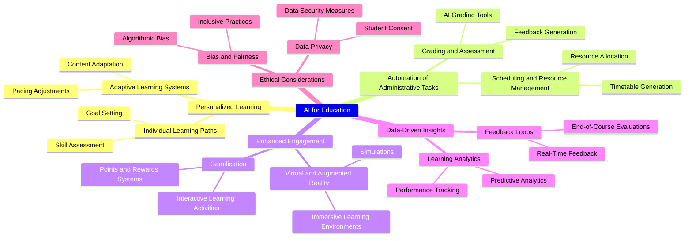

### MindMap


<video controls>
  <source src="https://github.com/user-attachments/assets/06a7b483-6a7a-4579-be7e-fb4f6bbc5092" type="video/mp4">
  Your browser does not support the video tag.
</video>


### Prompt

```
You are an expert at creating structured, hierarchical mind maps. Your task is to generate a mind map based on the central keyword provided.
The output MUST be a single, valid JSON object ONLY. Do not include any text, explanations, or markdown fences like ```json around the JSON output.

The JSON structure must be recursive, with a root node containing "title" and "children" properties. Each child is an object with the same structure. The hierarchy should be logical and expand upon the keyword. Generate a map at least 3 levels deep where appropriate.

Example structure:
{
  "title": "Root Keyword",
  "children": [
    {
      "title": "Main Branch 1",
      "children": [
        { "title": "Sub-topic 1.1" },
        { "title": "Sub-topic 1.2" }
      ]
    },
    {
      "title": "Main Branch 2"
    }
  ]
}

Now, generate this JSON structure for the keyword: "
```

### Convert Markdown 



### Data Struct

Use JSON to create MindMap

Root object is main topic

```json
{
  "title": "AI for Education",
  "children": [
    {
      "title": "Personalized Learning",
      "children": [
        {
          "title": "Adaptive Learning Systems",
          "children": [
            {
              "title": "Content Adaptation",
              "children": null
            },
            {
              "title": "Pacing Adjustments",
              "children": null
            }
          ]
        },
        {
          "title": "Individual Learning Paths",
          "children": [
            {
              "title": "Skill Assessment",
              "children": null
            },
            {
              "title": "Goal Setting",
              "children": null
            }
          ]
        }
      ]
    },
    {
      "title": "Automation of Administrative Tasks",
      "children": [
        {
          "title": "Grading and Assessment",
          "children": [
            {
              "title": "AI Grading Tools",
              "children": null
            },
            {
              "title": "Feedback Generation",
              "children": null
            }
          ]
        },
        {
          "title": "Scheduling and Resource Management",
          "children": [
            {
              "title": "Timetable Generation",
              "children": null
            },
            {
              "title": "Resource Allocation",
              "children": null
            }
          ]
        }
      ]
    },
    {
      "title": "Enhanced Engagement",
      "children": [
        {
          "title": "Gamification",
          "children": [
            {
              "title": "Points and Rewards Systems",
              "children": null
            },
            {
              "title": "Interactive Learning Activities",
              "children": null
            }
          ]
        },
        {
          "title": "Virtual and Augmented Reality",
          "children": [
            {
              "title": "Simulations",
              "children": null
            },
            {
              "title": "Immersive Learning Environments",
              "children": null
            }
          ]
        }
      ]
    },
    {
      "title": "Data-Driven Insights",
      "children": [
        {
          "title": "Learning Analytics",
          "children": [
            {
              "title": "Performance Tracking",
              "children": null
            },
            {
              "title": "Predictive Analytics",
              "children": null
            }
          ]
        },
        {
          "title": "Feedback Loops",
          "children": [
            {
              "title": "Real-Time Feedback",
              "children": null
            },
            {
              "title": "End-of-Course Evaluations",
              "children": null
            }
          ]
        }
      ]
    },
    {
      "title": "Ethical Considerations",
      "children": [
        {
          "title": "Data Privacy",
          "children": [
            {
              "title": "Student Consent",
              "children": null
            },
            {
              "title": "Data Security Measures",
              "children": null
            }
          ]
        },
        {
          "title": "Bias and Fairness",
          "children": [
            {
              "title": "Algorithmic Bias",
              "children": null
            },
            {
              "title": "Inclusive Practices",
              "children": null
            }
          ]
        }
      ]
    }
  ]
}
```


